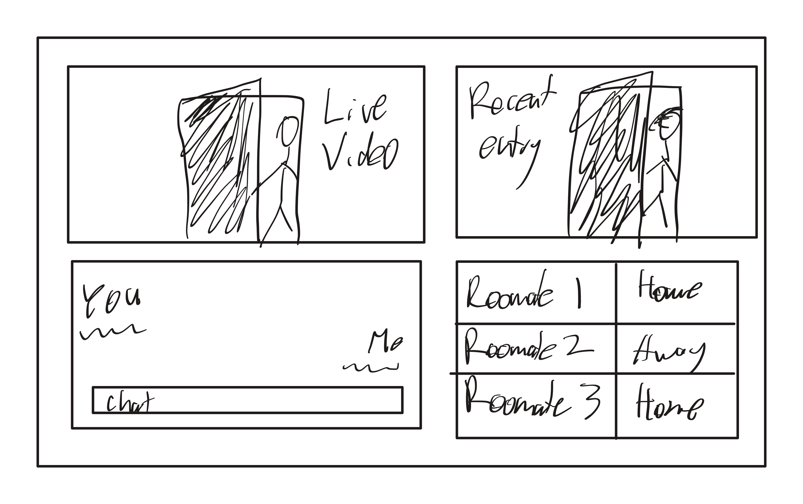
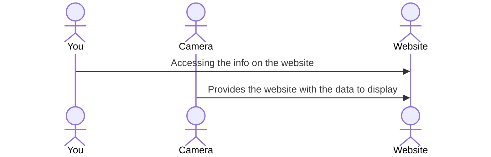

# N106 Roomate Tracker

[My Notes](notes.md)

This application allows access to a camera facing the front door of our apt. It tracks motion and will use AI to detect who is entering, and this website allows access to that data. It will show the live feed, which of the roomates is in the apt, as well as being able to access the logs of who came and went when. It also will have a messaging service so that users can message eachother.

## 🚀 Specification Deliverable

- [x] Input elevator pitch
- [x] Made design
- [x] Description of key features
- [x] Description of how you will use each technology
- [x] Made the rough design image

### Elevator pitch

Do you ever with that you could see when your roomates were in the apartment but you aren't there and you don't want to install cameras in the whole apartment? With this app you will be able to see who was in your apartment and when, labeling times your roomates came or left, other people who entered or exited, as well as allowing for sending messages to roomates who are also on the website.

### Design

The homescreen will have the live video feed, a table of who is currently in the apartment, a photo of who entered most recently, as well as an area to chat with anyone else online. 

### Key features

- View live video from camera
- Table of who is in the apt and if not when they left
- A chat feature between those online
- Storing of who entered and exited and when

### Technologies

I am going to use the required technologies in the following ways.

- **HTML** - Make the basic webpages
- **CSS** - Used to style the data so that it will be displayed in a good way, moving photos or videos to fit as needed
- **React** - Used to help users login as well as helping display the photos and videos and tables of data
- **Service** - Used to help with loginging as well as storing messages sent, and saving who data from the camera
- **DB/Login** - Database of who entered and when as well as unknown users
- **WebSocket** - Chat services as well as any data updates for who is in the apartment, so that it can be live

## 🚀 AWS deliverable

For this deliverable I did the following. I checked the box `[x]` and added a description for things I completed.

- [x] **Server deployed and accessible with custom domain name** - [My server link](https://yourdomainnamehere.click).

## 🚀 HTML deliverable

For this deliverable I did the following. I checked the box `[x]` and added a description for things I completed.

- [x] **HTML pages** - I made the basic pages for index.html, camera.html, database.html, message.html
- [x] **Proper HTML element usage** - Set up the header and footer that was used for each page
- [x] **Links** - I put in links to the different pages as well as added some buttons that link between pages
- [x] **Text** - I put some text in for different things like the message page as well as the database
- [x] **3rd party API placeholder** - I put a table at the bottom to show the weather info
- [x] **Images** - I added a video that will be the live camera feed
- [x] **Login placeholder** - I set up the login page in the index.html page
- [x] **DB data placeholder** - I made the database.html page that will track when people enter and exit
- [x] **WebSocket placeholder** - I got a page set up so that people will be able to messag eachother

## 🚀 CSS deliverable

For this deliverable I did the following. I checked the box `[x]` and added a description for things I completed.

- [ ] **Visually appealing colors and layout. No overflowing elements.** - I did not complete this part of the deliverable.
- [ ] **Use of a CSS framework** - I did not complete this part of the deliverable.
- [ ] **All visual elements styled using CSS** - I did not complete this part of the deliverable.
- [ ] **Responsive to window resizing using flexbox and/or grid display** - I did not complete this part of the deliverable.
- [ ] **Use of a imported font** - I did not complete this part of the deliverable.
- [ ] **Use of different types of selectors including element, class, ID, and pseudo selectors** - I did not complete this part of the deliverable.

## 🚀 React part 1: Routing deliverable

For this deliverable I did the following. I checked the box `[x]` and added a description for things I completed.

- [ ] **Bundled using Vite** - I did not complete this part of the deliverable.
- [ ] **Components** - I did not complete this part of the deliverable.
- [ ] **Router** - I did not complete this part of the deliverable.

## 🚀 React part 2: Reactivity deliverable

For this deliverable I did the following. I checked the box `[x]` and added a description for things I completed.

- [ ] **All functionality implemented or mocked out** - I did not complete this part of the deliverable.
- [ ] **Hooks** - I did not complete this part of the deliverable.

## 🚀 Service deliverable

For this deliverable I did the following. I checked the box `[x]` and added a description for things I completed.

- [ ] **Node.js/Express HTTP service** - I did not complete this part of the deliverable.
- [ ] **Static middleware for frontend** - I did not complete this part of the deliverable.
- [ ] **Calls to third party endpoints** - I did not complete this part of the deliverable.
- [ ] **Backend service endpoints** - I did not complete this part of the deliverable.
- [ ] **Frontend calls service endpoints** - I did not complete this part of the deliverable.
- [ ] **Supports registration, login, logout, and restricted endpoint** - I did not complete this part of the deliverable.

## 🚀 DB deliverable

For this deliverable I did the following. I checked the box `[x]` and added a description for things I completed.

- [ ] **Stores data in MongoDB** - I did not complete this part of the deliverable.
- [ ] **Stores credentials in MongoDB** - I did not complete this part of the deliverable.

## 🚀 WebSocket deliverable

For this deliverable I did the following. I checked the box `[x]` and added a description for things I completed.

- [ ] **Backend listens for WebSocket connection** - I did not complete this part of the deliverable.
- [ ] **Frontend makes WebSocket connection** - I did not complete this part of the deliverable.
- [ ] **Data sent over WebSocket connection** - I did not complete this part of the deliverable.
- [ ] **WebSocket data displayed** - I did not complete this part of the deliverable.
- [ ] **Application is fully functional** - I did not complete this part of the deliverable.
