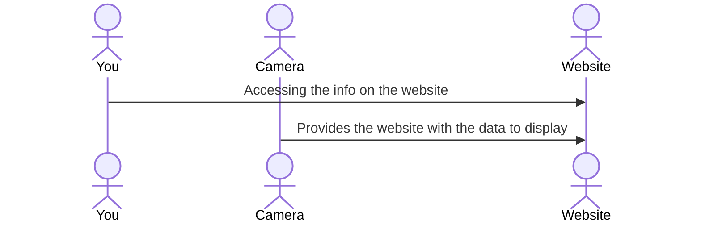

# N106 Roomate Tracker

[My Notes](notes.md)

This application allows access to a camera facing the front door of our apt. It tracks motion and will use AI to detect who is entering, and this website allows access to that data. It will show the live feed, which of the roomates is in the apt, as well as being able to access the logs of who came and went when. It also will have a messaging service so that users can message eachother.

## 🚀 Specification Deliverable

- [x] Input elevator pitch
- [x] Made design
- [x] Description of key features
- [x] Description of how you will use each technology
- [x] Made the rough design image

### Elevator pitch

Do you ever with that you could see when your roomates were in the apartment but you aren't there and you don't want to install cameras in the whole apartment? With this app you will be able to see who was in your apartment and when, labeling times your roomates came or left, other people who entered or exited, as well as allowing for sending messages to roomates who are also on the website.

### Design

The homescreen will have the live video feed, a table of who is currently in the apartment, a photo of who entered most recently, as well as an area to chat with anyone else online. 

```mermaid
sequenceDiagram
    actor You
    actor Camera
    actor Website
    You->>Website: Accessing the info on the website
    Camera->>Website: Provides the website with the data to display
```

### Key features

- View live video from camera
- Table of who is in the apt and if not when they left
- A chat feature between those online
- Storing of who entered and exited and when

### Technologies

I am going to use the required technologies in the following ways.

- **HTML** - Make the basic webpages
- **CSS** - Styled the page, set a color scheme, and made it look nice.
- **React** - Used to help users login as well as helping display the photos and videos and tables of data
- **Service** - Used to help with loginging as well as storing messages sent, and saving who data from the camera
- **DB/Login** - Database of who entered and when as well as unknown users
- **WebSocket** - Chat services as well as any data updates for who is in the apartment, so that it can be live

## 🚀 AWS deliverable

For this deliverable I did the following. I checked the box `[x]` and added a description for things I completed.

- [x] **Server deployed and accessible with custom domain name** - [My server link](https://yourdomainnamehere.click).

## 🚀 HTML deliverable

For this deliverable I did the following. I checked the box `[x]` and added a description for things I completed.

- [x] **HTML pages** - I made the basic pages for index.html, camera.html, database.html, message.html
- [x] **Proper HTML element usage** - Set up the header and footer that was used for each page
- [x] **Links** - I put in links to the different pages as well as added some buttons that link between pages
- [x] **Text** - I put some text in for different things like the message page as well as the database
- [x] **3rd party API placeholder** - I put a table at the bottom to show the weather info
- [x] **Images** - I added a video that will be the live camera feed
- [x] **Login placeholder** - I set up the login page in the index.html page
- [x] **DB data placeholder** - I made the database.html page that will track when people enter and exit
- [x] **WebSocket placeholder** - I got a page set up so that people will be able to messag eachother

## 🚀 CSS deliverable

For this deliverable I did the following. I checked the box `[x]` and added a description for things I completed.

- [x] **Visually appealing colors and layout. No overflowing elements.** - Used a flex layout and set scaling for most things
- [x] **Use of a CSS framework** - Used bootstrap for database.html for the table
- [x] **All visual elements styled using CSS** - Done
- [x] **Responsive to window resizing using flexbox and/or grid display** - The window scales and set min size for things that needed it
- [x] **Use of a imported font** - Used the Star-shield-2 font
- [x] **Use of different types of selectors including element, class, ID, and pseudo selectors** - I did this

## 🚀 React part 1: Routing deliverable

For this deliverable I did the following. I checked the box `[x]` and added a description for things I completed.

- [x] **Bundled using Vite** - I did this
- [x] **Components** - Done
- [x] **Router** - Done

## 🚀 React part 2: Reactivity deliverable

For this deliverable I did the following. I checked the box `[x]` and added a description for things I completed.

- [x] **All functionality implemented or mocked out** - I did this
- [x] **Hooks** - Done
- Notes:
    To simulate the login functionality I made a class for authenticated or not, and based on that the site determines what the user can see.  It saves the login username in local storage and that username is used a few other places like on the message board to determine how messages are organized
    
    To simulate the message board I made two functions, one that will get and populate messages, for the time being it gets them from an array but later it will get it from the server. There is another function that is used when a message is sent to update the functions on screen and move them up. This will be used when a user sends a message to update the messages that are displayed. There is also a automated message that shows up every 10 seconds to simulate the websocket in the future.

    To simulate the database functionality there is a function that gets the data and loops through it to make a table. Right now it gets it from a array but once a server/database is functioning it will be able to get the data from there.

    There is also a basic weather update functionality that right now just gets set values but the function is set up so it can get the data from a service for later. 

## 🚀 Service deliverable

For this deliverable I did the following. I checked the box `[x]` and added a description for things I completed.

- [x] **Node.js/Express HTTP service** - I did complete this part of the deliverable.
- [x] **Static middleware for frontend** - I did complete this part of the deliverable.
- [x] **Calls to third party endpoints** - I did complete this part of the deliverable.
- [x] **Backend service endpoints** - I did complete this part of the deliverable.
- [x] **Frontend calls service endpoints** - I did complete this part of the deliverable.
- [x] **Supports registration, login, logout, and restricted endpoint** - I did complete this part of the deliverable.
- Notes:
    I got the backend services all set up. The frontend uses endpoints to create users, login, logout, add data to databse, as well as send messages. While doing those it uses middleware to confrim that the user is authorized to have access using cookies.

    I got the 3rd party API to work to get the weather data at the bottom of the page. At somepoint I want to get it set up to get a live video feed, but I didn't have enough time to implement that for today. Because of this I removed the camera navigation link as well as got rid of the video element when the page is displayed. It was replaced with a basic this page is down message.

    For the create user, I don't want this to just be a page that anyone can create a account for and have access, it is meant to be for our roomates. Because of this I moved the create user to a different page, and to access the person logged in needs admin rights. When a admin user logs in it will show the tab, as well as allowing them to make other people's accounts. When a normal user is logged in it doesn't show the create user page, and if someone navigates to the page and tries to make an account it tells them they are unauthorized.

## 🚀 DB deliverable

For this deliverable I did the following. I checked the box `[x]` and added a description for things I completed.

- [x] **Stores data in MongoDB** - I did complete this part of the deliverable.
- [x] **Stores credentials in MongoDB** - I did complete this part of the deliverable.
- Notes:
    Added all the server DB functionality. Most functions were just making a function in database.js for mongo then importing it and using it in the index.js file.

    There are 3 different databases, one for users, one for messages, and one for the entry database. 

    Honestly pretty simple because of how my code was set up to it was pretty easy to do. One change I did make is my send message and make entry function used to return the database/message list. I changed it so they just return a status code then in the functions in the jsx file it calls the getmessage/getentry function as a part of the adding function so it is clearer what it is doing.

## 🚀 WebSocket deliverable

For this deliverable I did the following. I checked the box `[x]` and added a description for things I completed.

- [x] **Backend listens for WebSocket connection** - I did complete this part of the deliverable.
- [x] **Frontend makes WebSocket connection** - I did complete this part of the deliverable.
- [x] **Data sent over WebSocket connection** - I did complete this part of the deliverable.
- [x] **WebSocket data displayed** - I did complete this part of the deliverable.
- [x] **Application is fully functional** - I did complete this part of the deliverable.
- Notes:
    Took me a bit to understand how websocket works and how everything is connected and how to configure it all. Had some issues with the port it was listening on and configuring that. Also had some issues while testing with using the same account which would cause one to become unathenditacted. Check notes for more information.

    I set it up so that when a message it sent it is first sent to the database and saved there. Then after it is saved it updates the page and sends a websocket message to other users to refresh their page and get messages from the database. I did this so that the messages will always be in sync with the database, and it doesn't somehome get out of sync.